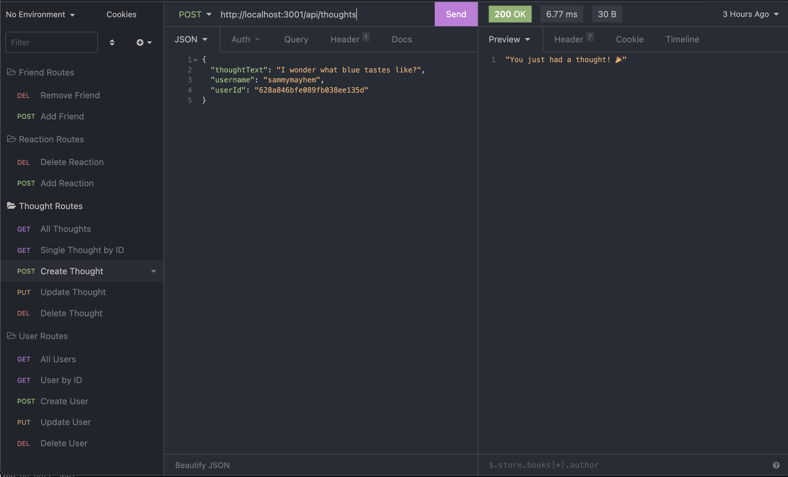

# Face Space Social Media API

## Introduction

Welcome to the FaceSpace Social Media API! Here at FaceSpace we strive to give everybody the best outlet to make friends and share their thoughts. The best part of it, is then your friends can share reactions to your thoughts! What an age we live in. I was motivated to create this api so that my friends and I had a space to share our thoughts and then comment on those thoughts ourselves. I enjoyed developing thie API and honing my skill with MongoDB and Mongoose.

## Languages and Technologies

ExpressJS
MomentJS
MondoDB
Mongoose

## Usage

This API can be used to track, and edit if need be, the users, thoughts, reactions and friends for your social network. Using the provided API will hopefully help streamline your process!

## Link to Video Demonstration

Part 1: [Link to Video 1]( https://drive.google.com/file/d/1KzD1K_3vsxRO57rYkX8o11vzgJKOsSsR/view)

Part 2: [Link to Video 2]( https://drive.google.com/file/d/1skDMLgvwl82YRK6_LW60Hs6rpeMNRhA4/view)

## Screenshots

All users:

User by ID:

Create user:

All thoughts: 

Create thought:

## Credits

This API would not have been possible without MongoDB and Mongoose to handle the users, thoughts, friends and reactions. 